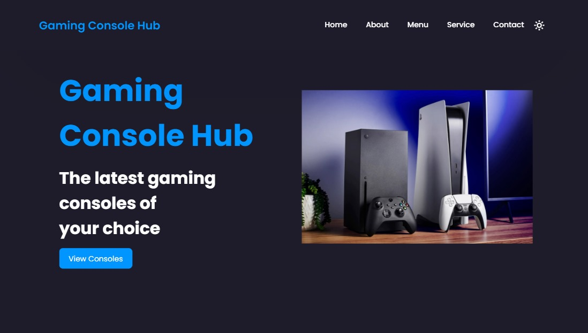

<h2 align="center">
  Gaming Console Hub Landing Page
</h2>

  

## Table of Contents

- [Introduction](#introduction)
- [Features](#features)
- [Usage](#usage)
- [License](#license)

## Introduction

Welcome to the Gaming Console Hub Landing Page! This landing page showcases the latest gaming consoles, providing users with information about various gaming options. It's built using HTML, CSS, and JavaScript, offering an engaging and interactive experience.

## Features

- Informative sections introducing the landing page, including Home, About, Menu (showcasing console options), Services, Connect, and Contact.
- Responsive design ensuring seamless access across different devices.
- Dark mode functionality for user preference.

## Usage

To explore the Gaming Console Hub Landing Page:

1. Clone or download the repository to your local machine.
2. Open the `index.html` file in your web browser.
3. Navigate through different sections using the provided links in the navbar.
4. Experience the interactive features such as the dark mode toggle and scroll reveal animations.

Feel free to customize the landing page according to your preferences or use it as a template for your own projects!

## License

This project is licensed under the [MIT License](LICENSE).

## Show your support

If you find this landing page helpful or inspiring, consider giving it a ⭐️ on GitHub!
